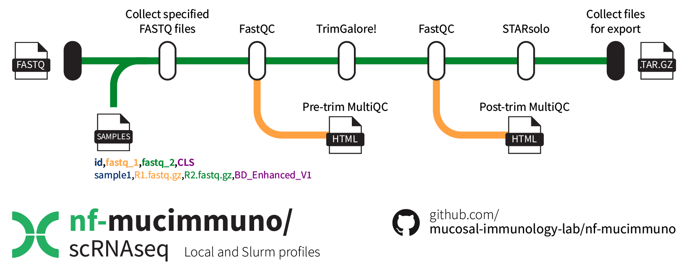
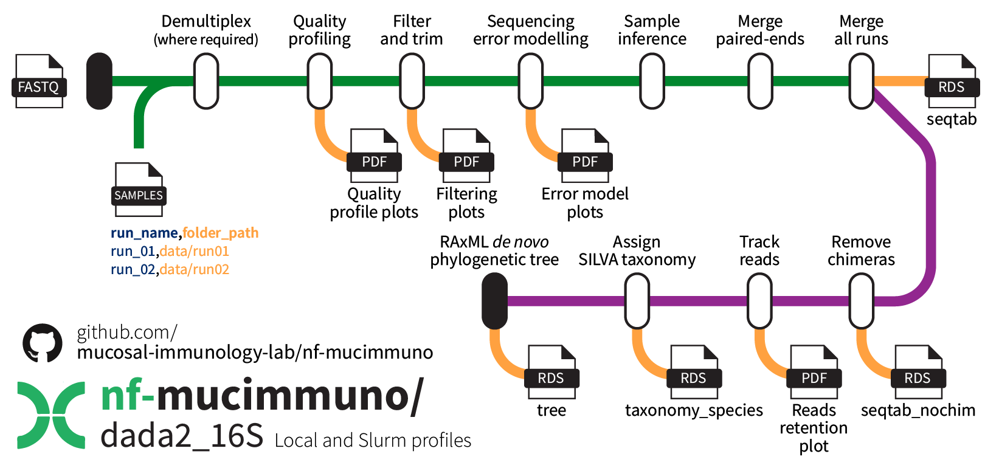

# Nextflow Workflows

As they are built and published, this repository will contain Nextflow workflows for processing of different data omic modalities.

Additionally, we may provide additional tools and code for further downstream processing, with the goal of standardising data analytic approaches within the Mucosal Immunology Lab.

- [Nextflow Workflows](#nextflow-workflows)
  - [Single-cell RNAseq FASTQ pre-processing](#single-cell-rnaseq-fastq-pre-processing)
  - [DADA2 16S rRNA amplicon sequencing pre-processing](#dada2-16s-rrna-amplicon-sequencing-pre-processing)

## Single-cell RNAseq FASTQ pre-processing

[**nf-mucimmuno/scRNAseq**](./scRNAseq/) is a bioinformatics pipeline for single-cell RNA sequencing data that can be used to run quality control steps and alignment to a host genome using STARsolo. Currently configured for use with data resulting from either BD Rhapsody or 10X Chromium library preparation.

## DADA2 16S rRNA amplicon sequencing pre-processing

[**nf-mucimmuno/dada2_16S**](./dada2_16S/) is a bioinformatics pipeline for automated pre-processing of raw 16S rRNA amplicon sequencing data with the popular DADA2 pipeline and SILVA-derived taxonomic assignments. It can be used to handle multiple runs (either pre- or post-demultiplexing) and combine them into a single table.

